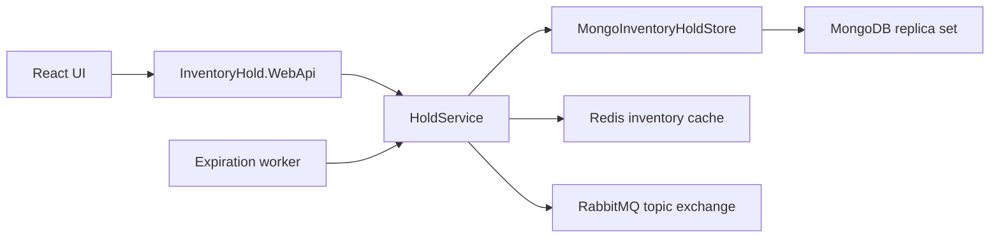

# Inventory Hold Microservice

Temporary checkout holds for inventory. A hold deducts stock atomically, expires after a configurable duration, and publishes lifecycle events.

## Architecture



Dependency direction:

- `InventoryHold.Contracts` has transport DTOs and event payloads only.
- `InventoryHold.Domain` owns entities, validation, and the hold lifecycle. It does not reference MongoDB, Redis, or RabbitMQ.
- `InventoryHold.Infrastructure` implements the store, cache, and publisher.
- `InventoryHold.WebApi` is the composition root and HTTP adapter.
- `InventoryHold.UnitTests` mock the store, cache, and publisher. They do not start infrastructure.

## Project structure

```text
src/InventoryHold.Contracts
src/InventoryHold.Domain
src/InventoryHold.Infrastructure
src/InventoryHold.WebApi
src/InventoryHold.UnitTests
frontend
docker-compose.yml
Dockerfile
```

## Setup

Requires the .NET 10 SDK, Docker, and Node.js 20+.

Start the full backend:

```bash
docker-compose up --build
```

The API listens on http://localhost:8080. MongoDB is a single-node replica set because multi-document transactions require one. The `mongo-init` service runs `rs.initiate` before the API starts. The API also waits until MongoDB reports a writable primary.

Frontend, from `frontend`:

```bash
npm install
npm run dev
```

Open http://localhost:5173. Vite proxies `/api` to http://localhost:8080.

To run the API on the host instead of in Docker, start only the infrastructure and point the host at the replica-set hostname:

```bash
docker-compose up mongodb mongo-init redis rabbitmq
```

Add this line to the hosts file (`C:\Windows\System32\drivers\etc\hosts`):

```text
127.0.0.1 mongodb
```

The replica set advertises `mongodb:27017`. Both the API container and a host process can use it once that name resolves. Then:

```bash
dotnet run --project src/InventoryHold.WebApi
```

## API examples

Create a hold:

```bash
curl -X POST http://localhost:8080/api/holds ^
  -H "Content-Type: application/json" ^
  -d "{\"items\":[{\"productId\":\"prod-wireless-mouse\",\"quantity\":2}]}"
```

Read it:

```bash
curl http://localhost:8080/api/holds/{holdId}
```

List active holds:

```bash
curl "http://localhost:8080/api/holds?status=active"
```

Release it:

```bash
curl -X DELETE http://localhost:8080/api/holds/{holdId}
```

Inventory:

```bash
curl http://localhost:8080/api/inventory
```

Errors use one shape:

```json
{ "errorCode": "INSUFFICIENT_STOCK", "message": "Not enough stock to place this hold." }
```

| Status | When |
| --- | --- |
| 201 | Hold created |
| 200 | Hold or inventory read, active list |
| 204 | Hold released |
| 400 | Invalid body, non-positive quantity, duplicate product, unsupported status filter |
| 404 | Unknown product or hold |
| 409 | Insufficient stock, already released, or expired |
| 500 | Unexpected failure |

Optional `clientRequestId` makes create idempotent. Replaying the same key returns the original hold and does not deduct stock again. When the key is omitted, the field is left off the MongoDB document so the sparse unique index does not treat every missing key as the same value.

Seeded products: Wireless Mouse, Mechanical Keyboard, USB-C Hub, 27-inch Monitor, Laptop Stand.

## Environment variables

| Variable | Default |
| --- | --- |
| `Mongo__ConnectionString` | `mongodb://mongodb:27017/?replicaSet=rs0` |
| `Mongo__DatabaseName` | `inventory_hold` |
| `Redis__ConnectionString` | `localhost:6379` locally, `redis:6379` in Compose |
| `Redis__InventoryTtlSeconds` | `10` |
| `RabbitMq__Host` | `localhost` / `rabbitmq` |
| `RabbitMq__Port` | `5672` |
| `RabbitMq__Username` | `guest` |
| `RabbitMq__Password` | `guest` |
| `RabbitMq__Exchange` | `inventory.holds` |
| `Holds__DurationMinutes` | `15` |
| `Holds__ExpirationPollSeconds` | `15` locally, `10` in Compose |
| `Cors__Origins__0` | `http://localhost:5173` |

Application code reads these through options. Connection details are not hardcoded in the domain or controllers.

## MongoDB concurrency

Stock is never deducted with a read followed by a separate write.

`PlaceHoldAsync` opens a transaction and, for every line in product-id order, runs:

```text
filter: productId == id AND availableQuantity >= requested
update: $inc availableQuantity by -requested
```

If any line matches zero documents, the transaction aborts and nothing is kept. The hold document is inserted in the same transaction, so a crash cannot leave stock deducted without a hold. One product and many products use the same path. A transaction around a single conditional update is stricter than a lone atomic update, and it keeps the hold insert atomic too.

Release and expiry use compare-and-set inside a transaction:

```text
filter: holdId == id AND status == Active
update: status = Released or Expired
```

Only the caller that receives the updated document restores each line with `$inc` and then commits. The loser sees the current status and does not restore or publish. Transient transaction errors are retried. A commit whose result is unknown is not retried, because a retry could create a second hold.

## Redis

`GET /api/inventory` reads Redis key `inventory:catalog` and falls back to MongoDB on a miss or a Redis error. The TTL defaults to 10 seconds. Create, release, and expiry delete that key after the MongoDB transaction commits. Stock deduction does not read Redis. MongoDB remains the source of truth. If invalidation fails, the catalog can be stale only until the TTL.

## RabbitMQ

Durable topic exchange `inventory.holds`.

| Event | Routing key | Queue declared for inspection |
| --- | --- | --- |
| HoldCreated | `hold.created` | `inventory.holds.created` |
| HoldReleased | `hold.released` | `inventory.holds.released` |
| HoldExpired | `hold.expired` | `inventory.holds.expired` |

Payloads include event id, event type, occurrence time, hold id, status, created and expiry timestamps, and each product id, name, and quantity. Messages are persistent. Publishing happens only after the MongoDB transaction commits. If the broker is still down after retries, the API logs the failure and still returns the successful hold change. There is no outbox, so a broker outage can drop an event.

Management UI: http://localhost:15672 (`guest` / `guest`).

## Expiration

`HoldExpirationWorker` periodically loads active holds whose `ExpiresAtUtc` is in the past and runs the same compare-and-set expiry as a read. `GET /api/holds/{holdId}` expires a due hold immediately, so expiry does not depend on the worker. `DELETE` on a due active hold expires it, restores stock once, publishes `HoldExpired`, and returns 409. A second release or expiry does not restore stock again.

## Tests

```bash
dotnet test InventoryHold.slnx
```

The suite covers invalid requests, duplicate products, missing products, insufficient stock, successful multi-line holds, `HoldCreated`, idempotent replay, release and stock restoration, missing and already released holds, expiry on read and on delete, a lost compare-and-set, the expiration sweep, active-list filtering, cache hits, and cache invalidation. Cache reads are rejected during hold creation.

## Frontend state

The page keeps one React state snapshot of inventory and active holds. Create and release call the API and then refresh both lists, so the dashboard updates without a browser reload. A five-second refresh also picks up expirations. Loading and API error text are shown on the page. Release asks for confirmation first.

## Design decisions

- Duplicate product ids are rejected instead of being merged, so a client cannot hide a quantity mistake.
- Hold duration, cache TTL, broker settings, and connection strings are configuration.
- The frontend stays out of Compose. `npm run dev` is enough, and Vite proxies the API.
- Example queues are declared so events are visible in the management UI. A production consumer should own its own queue.
- Guest RabbitMQ credentials and MongoDB without authentication are for local assignment use.

## Known limitations

- No transactional outbox. A publish failure after commit can lose an event.
- `UnknownTransactionCommitResult` is not retried.
- Seed runs only when the product collection is empty.
- No authentication.
- Integration tests against real MongoDB, Redis, and RabbitMQ are not included. Concurrency is covered with a thread-safe fake of the store contract.
- The local .NET 10 SDK may be installed per user at `%LOCALAPPDATA%\Microsoft\dotnet` if the machine-wide SDK is still .NET 9.

## Traceability

| Requirement | Implementation |
| --- | --- |
| .NET 10 Web API and DDD projects | `src/InventoryHold.*`, `InventoryHold.slnx` |
| POST /api/holds | `HoldsController`, `HoldService.CreateAsync`, `MongoInventoryHoldStore.PlaceHoldAsync` |
| GET /api/holds/{holdId} with immediate expiry | `HoldService.GetAsync` |
| DELETE /api/holds/{holdId} | `HoldService.ReleaseAsync` |
| GET /api/holds?status=active | `HoldService.ListActiveAsync` |
| GET /api/inventory and seed data | `InventoryController`, `ProductCatalog` |
| Atomic stock filter and multi-item transaction | `MongoInventoryHoldStore` |
| Compare-and-set release and expiry | `TryTransitionAndRestoreAsync` |
| Expiration worker | `HoldExpirationWorker` |
| RabbitMQ topic events | `RabbitMqHoldEventPublisher` |
| Redis cache and invalidation | `RedisInventoryCache`, `InventoryQueryService` |
| Configurable connections and hold duration | `appsettings.json`, Compose environment |
| Docker Compose one command | `docker-compose.yml`, `Dockerfile` |
| Unit tests without infrastructure | `src/InventoryHold.UnitTests` |
| React inventory, create, active holds, release | `frontend/src/App.tsx` |
| AI audit | `AI-USAGE.md` |
